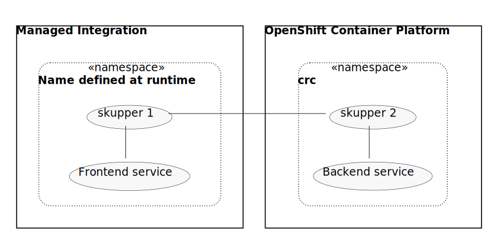

:cluster-type: OpenShift Container Platform
:solution-pattern-title: Communicating with an {cluster-type} cluster using Skupper
:skupper-name: Skupper
:skupper_cli_release: 0.2.0
:ocp: true

:west-cluster: Managed Integration
:west-namespace: {project-namespace}
:west-cli: oc
:skupper-west: skupper 1

:east-cluster: {cluster-type}
:east-namespace: ocp
:east-docs-link: https://docs.openshift.com/container-platform/4.4/welcome/index.html
:east-cli: oc
:skupper-east: skupper 2

= {solution-pattern-title}

Securely enable communications across OpenShift clusters.

This Solution Pattern uses an HTTP Hello World application with a frontend service and a backend service.
The frontend uses the backend to process requests.
The frontend is deployed in the *{west-namespace}* namespace of the {west-cluster} cluster, and the backend is deployed in the *{east-namespace}* namespace of a {east-cluster} cluster.

:overview-uml: overview

While these instructions use this particular application for demonstration purposes, the steps are the same for any Skupper
deployment.

.Prerequisites

* You must have `oc` installed

[type=walkthroughResource]
.Skupper
****
* https://skupper.io[Skupper Website]
* https://github.com/skupperproject/skupper-example-hello-world[HTTP Hello World example code]
* https://github.com/skupperproject/skupper-example-tcp-echo[TCP-based service example code]
* link:https://skupper.io/examples/index.html[Explore the examples]
****

[type=walkthroughResource,serviceName=openshift]
.Red Hat OpenShift
****
* link:{openshift-host}/console[Console, window="_blank"]
* link:https://help.openshift.com/[Openshift Online Help Center, window="_blank"]
* link:https://blog.openshift.com/[Openshift Blog, window="_blank"]
****
:sectnums:

[time=5]
== Installing the Skupper cli in your local environment

The `skupper` command-line tool is the primary entrypoint for
installing and configuring the Skupper infrastructure.

. Download the latest release of the Skupper command for your platform,
+
For Linux or WSL on Windows, enter:
+
[subs="attributes+"]
----
curl -fL https://github.com/skupperproject/skupper-cli/releases/download/{skupper_cli_release}/skupper-cli-{skupper_cli_release}-linux-amd64.tgz | tar -xzf -
----
+
For macOS, enter:
+
[subs="attributes+"]
----
curl -fL https://github.com/skupperproject/skupper-cli/releases/download/{skupper_cli_release}/skupper-cli-{skupper_cli_release}-mac-amd64.tgz | tar -xzf -
----
+
This produces an executable file named `skupper` in your current
directory.
+
NOTE: See the https://github.com/skupperproject/skupper-cli/releases[Skupper CLI release
page] for information on other platforms.

. Add `skupper` to your path
+
For example:
+
----
mkdir -p $HOME/bin
export PATH=$PATH:$HOME/bin
mv skupper $HOME/bin
----

[type=verification]
****
To test your installation:

----
$ skupper --version
----

Do you see the following output:

[subs="attributes+"]
----
skupper version {skupper_cli_release}
----
****

[type=verificationFail]
Try the steps again. If it's still not working contact your administrator, or seek help at https://skupper.io

[time=5]
== Configuring access to multiple namespaces

Skupper is designed for use with multiple namespaces, typically on
different clusters.  The `skupper` command uses your kubeconfig and
current context to select the namespace where it operates.

=== Configure separate terminal sessions

Start a terminal session for each of your namespaces.  Set the
`KUBECONFIG` environment variable to a different path in each session.

. Start a terminal for the *{west-cluster}* cluster:

 export KUBECONFIG=$HOME/.kube/config-west

. Start a terminal for the *{east-cluster}* cluster:

 export KUBECONFIG=$HOME/.kube/config-east

=== Log in to your clusters

. Log into the *{west-cluster}* cluster.

.. Navigate to the link:{openshift-host}/console[OpenShift Console, window="_blank"]

.. Choose *Copy Login Command* from the menu displayed when you click on your username.

.. Enter the command into the *{west-cluster}* terminal session.

. Log into the *{east-cluster}* cluster.

.. Log into the {east-cluster} cluster using the command displayed in the output, for example:

 $ oc login -u developer -p developer https://api.crc.testing:6443

=== Set the current namespaces

. In the terminal for the *{west-cluster}* cluster:
+
[subs="attributes+"]
----
{west-cli} config set-context --current --namespace {west-namespace}
----

. In the terminal for the *{east-cluster}* cluster:
+
[subs="attributes+"]
----
{east-cli} new-project {east-namespace}
{east-cli} config set-context --current --namespace {east-namespace}
----

[type=verification]
****
Do the following commands display the expected output?

Once you have logged in and set the current namespaces, use the
`skupper status` command to check that each namespace is correctly
configured.

. In the terminal for the *{west-cluster}* cluster:
+
[subs="attributes+"]
----
 $ skupper status
----
+
The following output is displayed:
+
[subs="attributes+"]
----
 skupper not enabled for {west-namespace}
----
. In the terminal for the *{east-cluster}* cluster:
+
[subs="attributes+"]
----
 $ skupper status
----
+
The following output is displayed:
+
[subs="attributes+"]
----
 skupper not enabled for {east-namespace}
----

****

[type=verificationFail]
Try the steps again. If it's still not working contact your administrator, or seek help at https://skupper.io

[time=5]
== Installing the Skupper router and connecting the namespaces

Running the `skupper init` command in east namespace installs the router.

Connecting namespaces requires you use the following commands:

* The `skupper connection-token` command generates a secret token that
signifies permission to connect.  The token also carries the
connection details.

* The `skupper connect` command then uses the
connection token to establish a connection to the namespace that
generated it.

NOTE: Anyone who has the connection token can connect to your namespace.  Make sure that only those
you trust have access to it.

=== Install the router in both namespaces

. In the terminal for the {west-cluster}:
+
----
 $ skupper init
----
+
The following output is displayed:
+
[subs="attributes+"]
----
 Skupper is now installed in namespace '{west-namespace}'.  Use 'skupper status' to get more information.
----

. In the terminal for the {east-cluster}:
+
----
 $ skupper init --edge
----
+
The following output is displayed:
+
[subs="attributes+"]
----
 Skupper is now installed in namespace '{east-namespace}'.  Use 'skupper status' to get more information.
----

NOTE: Using the `--edge` argument in the {east-namespace} namespace disables network ingress at the
Skupper router layer.

=== Connect your namespaces

. Generate a token in the *{west-namespace}*:
+
 skupper connection-token $HOME/secret.yaml

. Use the token in the *{east-namespace}* to form a connection
+
 skupper connect $HOME/secret.yaml

[type=verification]
****
Do the following commands display the expected output?

Use the
`skupper status` command to check that each namespace is correctly
configured.

. In the terminal for the *{west-cluster}* cluster:
+
----
 $ skupper status
----
+
The following output is displayed:
+
[subs="attributes+"]
----
 skupper enabled for {west-namespace}.  It is connected to 1 other site.
----

. In the terminal for the *{east-cluster}* cluster:
+
----
 $ skupper status
----
+
The following output is displayed:
+
[subs="attributes+"]
----
 skupper enabled for {east-namespace}. It is connected to 1 other site.

----
****

[type=verificationFail]
Try the steps again. If it's still not working contact your administrator, or seek help at https://skupper.io

[time=5]
== Exposing the services

You now have a Skupper network capable of multi-cluster communication,
but no services are attached to it.

This task describes how to use  the `skupper
expose` command to make a Kubernetes deployment on one namespace
available on all the connected namespaces.

=== Deploy the frontend and backend services

. Start the frontend in the *{west-cluster}* cluster:
+
 oc create deployment hello-world-frontend --image quay.io/skupper/hello-world-frontend

. Start the backend in the *{east-cluster}* cluster:
+
 oc create deployment hello-world-backend --image quay.io/skupper/hello-world-backend

=== Expose the backend service

At this point, we have the frontend and backend services running, but
the frontend has no way to contact the backend.  The frontend and
backend are in different namespaces and different clusters),
and the backend has no public ingress.

Use the `skupper expose` command in the {east-cluster} to make `hello-world-backend`
available in the {west-cluster}.

. In the terminal for the {east-cluster}:
+
 skupper expose deployment hello-world-backend --port 8080 --protocol http

. Check that the backend service is represented in the {west-cluster}:
+
 oc get services
+
The output should be similar to the following:
+
 $ kubectl get services
 NAME                   TYPE           CLUSTER-IP      EXTERNAL-IP     PORT(S)       AGE
 hello-world-backend    ClusterIP      10.96.175.18    <none>          8080/TCP      1m30s

=== Create a route

. In the {west-cluster}, expose a route:
+
 oc expose deployment hello-world-frontend --port 8080 --type LoadBalancer

. Navigate to the link:{openshift-host}/console[OpenShift Console, window="_blank"]

. Switch to the {west-namespace} project.

. In the *Overview*, expand the *hello-world-frontend* application.

. Click *Create Route*. This creates a route and displays a URL.

[type=verification]
****

Click the newly created URL.

Is the output  similar to the following:

 I am the frontend.  The backend says 'Hello from hello-world-backend-6d58c544fc-dhzz2 (1)'.

****

[type=verificationFail]
Try the steps again. If it's still not working contact your administrator, or seek help at https://skupper.io
